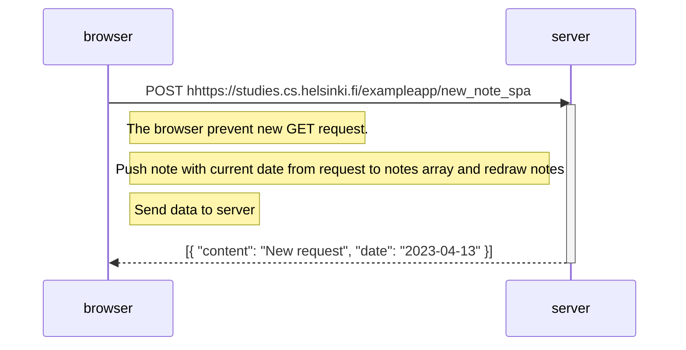

```mermaid
sequenceDiagram
  participant browser
  participant server
  
  browser->>server: POST hhttps://studies.cs.helsinki.fi/exampleapp/new_note_spa
  activate server
  note right of browser: The browser prevent new GET request. 
  note right of browser: Push note with current date from request to notes array and redraw notes
  note right of browser: Send data to server
  server-->>browser: [{ "content": "New request", "date": "2023-04-13" }]
  deactivate server
```